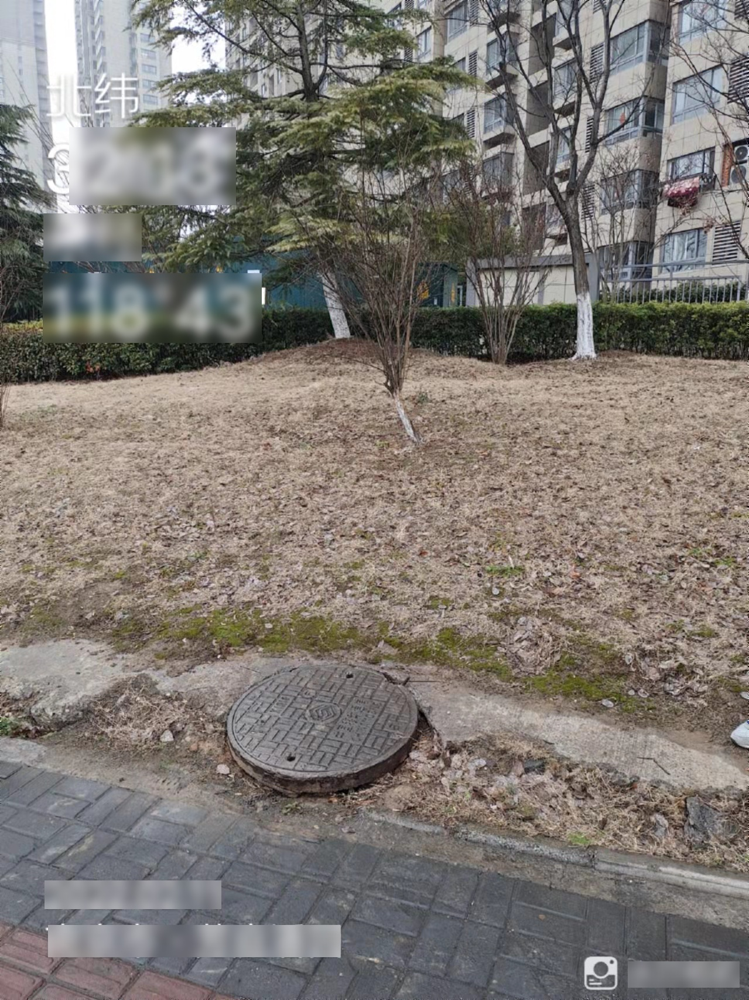
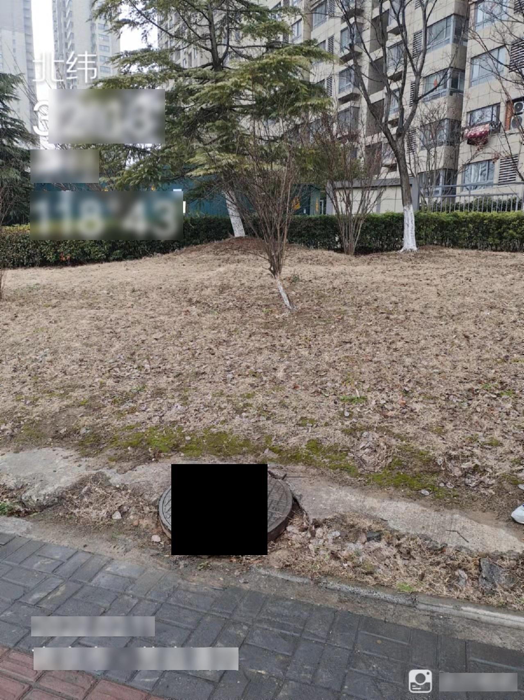

## Cutout data augment

A data enhancement method for Cutout in the data annotation box.

It can improve the efficiency of enhancement to a certain extent and avoid meaningless cutouts.

# attention

To run the code, you need to input images and tags at the same time. It is best for tags and images to be in the same order in the folder, otherwise tags and images will not correspond.

